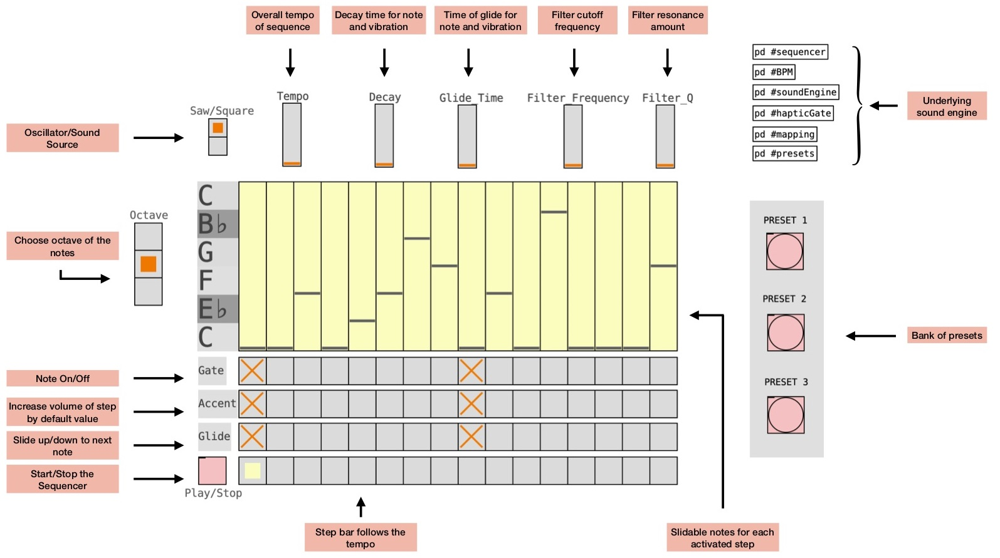
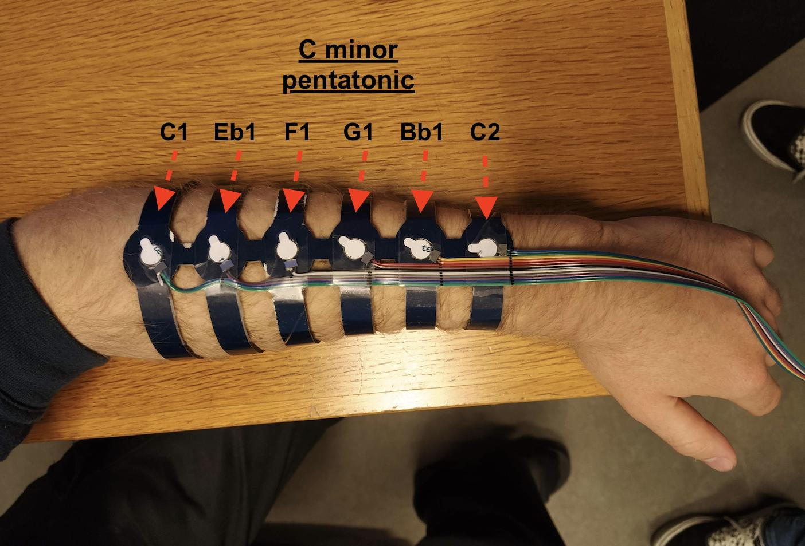
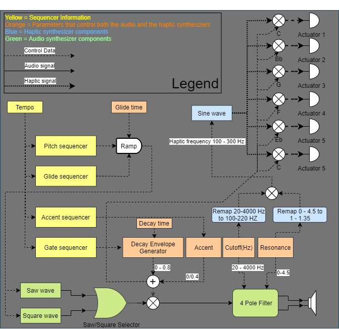

# Musical Armband 
A haptic synthesizer inspired by the roland TB303, designed for cochlear implant users

https://2021.worldhaptics.org/sic/

[Video Presentation Here](https://youtu.be/CfrG6zRcUiM)

## Authors

### Team

<!-- For each team member, duplicate this following subsection and update Name, biography, pronouns and website. Please store pictures under images/portraits/ and use only Name in CamelCase for filenames. -->

#### Razvan Paisa

I am currently a PhD studen at Aalborg University in Copenhagen, Denmark, working on integrating vibrotactile stimuli into music listening for cochlear implant users. For up-to-date information on what i do, visit our lab's page: [Multisensory Experience Lab](https://melcph.create.aau.dk/)

#### Anders Bargum (He/Him)

My name is Anders Bargum. I am an audio nerd and HCI interested student at the 'Sound and Music Computing' masters degree at Aalborg University in Copenhagen, Denmark. 
 
Find more information about the topics we are passionate about at <!-- update pronouns--> [SMC AAU](https://www.smc.aau.dk/).

<!-- ### Advisor -->

<!-- Uncomment this section title and add a #### Name subsection if your team appointed an advisor. -->

### Chairs

#### Christian Frisson

Christian Frisson is an associate researcher at the Input Devices and Music Interaction Laboratory (IDMIL) (2021), previously postdoctoral researcher at McGill University with the IDMIL (2019-2020), at the University of Calgary with the Interactions Lab (2017-2018) and at Inria in France with the Mjolnir team (2016-2017). He obtained his PhD at the University of Mons, numediart Institute, in Belgium (2015); his MSc in “Art, Science, Technology” from Institut National Polytechnique de Grenoble with the Association for the Creation and Research on Expression Tools (ACROE), in France (2006); his Masters in Electrical (Metrology) and Mechanical (Acoustics) Engineering from ENSIM in Le Mans, France (2005). 
Christian Frisson is a researcher in Human-Computer Interaction, with expertise in Information Visualization, Multimedia Information Retrieval, and Tangible/Haptic Interaction. Christian creates and evaluates user interfaces for manipulating multimedia data. Christian favors obtaining replicable, reusable and sustainable results through open-source software, open hardware and open datasets. 
With his co-authors, Christian obtained the IEEE VIS 2019 Infovis Best Paper award and was selected among 4 finalists for IEEE Haptics Symposium 2020 Most Promising WIP.

Find more information on his [website](https://frisson.re).

#### Jun Nishida

Jun Nishida is **Currently** Postdoctoral Fellow at University of Chicago & Research Fellow at Japan Society for the Promotion of Science (JSPS PDRA) / **Previously** JSPS Research Fellow (DC1), Project Researcher at Japanese Ministry of Internal Affairs and Communications, SCOPE Innovation Program & PhD Fellow at Microsoft Research Asia / Graduated from Empowerment Informatics Program, University of Tsukuba, Japan. 

I’m a postdoctoral fellow at University of Chicago. I have received my PhD in Human Informatics at University of Tsukuba, Japan in 2019. I am interested in designing experiences in which all people can maximize and share their physical and cognitive capabilities to support each other. I explore the possibility of this interaction in the field of rehabilitation, education, and design. To this end, I design wearable cybernic interfaces which share one’s embodied and social perspectives among people by means of electrical muscle stimulation, exoskeletons, virtual/augmented reality systems. Received more than 40 awards including Microsoft Research Asia Fellowship Award, national grants, and three University Presidential Awards. Review service at ACM SIGCHI, SIGGRAPH, UIST, TEI, IEEE VR, HRI.

Find more information on their [website](https://junis.sakura.ne.jp/wp).

#### Heather Culbertson

Heather Culbertson is a Gabilan Assistant Professor of Computer Science at the University of Southern California. Her research focuses on the design and control of haptic devices and rendering systems, human-robot interaction, and virtual reality. Particularly she is interested in creating haptic interactions that are natural and realistically mimic the touch sensations experienced during interactions with the physical world. Previously, she was a research scientist in the Department of Mechanical Engineering at Stanford University where she worked in the Collaborative Haptics and Robotics in Medicine (CHARM) Lab. She received her PhD in the Department of Mechanical Engineering and Applied Mechanics (MEAM) at the University of Pennsylvania in 2015 working in the Haptics Group, part of the General Robotics, Automation, Sensing and Perception (GRASP) Laboratory. She completed a Masters in MEAM at the University of Pennsylvania in 2013, and earned a BS degree in mechanical engineering at the University of Nevada, Reno in 2010. She is currently serving as the Vice-Chair for Information Dissemination for the IEEE Technical Committee on Haptics. Her awards include a citation for meritorious service as a reviewer for the IEEE Transactions on Haptics, Best Paper at UIST 2017, and the Best Hands-On Demonstration Award at IEEE World Haptics 2013.

Find more information on her [website](https://sites.usc.edu/culbertson/).

## Contents
Generated with `npm run toc`, see [INSTALL.md](INSTALL.md).
<!-- Table of contents generated by running from repository root: npm run toc -->

<!-- toc -->
- [Abstract](#abstract)
- [Introduction](#introduction)
- [Project description](#description)
- [Fabrication instructions](#instructions)
	+ [Hardware](#hardware)
		+ [Bill of Materials](#bom)
		+ [Assembly guide](#assembly)
			+ [Hardware platform](#hw)
			+ [Cardboard Armband](#Armband)
		   + [Wiring](#Wiring)
	 + [Software](#software)
		 + [Running instructions](#running)
		 + [Graphical User interface](#GUI)
- [Acknowledgements](#acknowledgements)
- [License](#license)

<!-- tocstop -->

## Abstract
<!-- Summarize your project: for now copy the short pitch from your proposal -->
303 Armband is a multi-actuator vibrotactile wearable device, designed to augment the music listening experience for persons using  cochlear implants. We constructed the device on the principle of *multisensory integration* that describes how humans form coherent, valid, and robust perception of reality, by processing sensory stimuli from various modalities. Multisensory integration suggests that enhancement  can occur only for stimuli that are temporally coincident and propose that enhancement is strongest for those stimuli that individually are least effective - in our case, the auditory one.

## Introduction
<!-- Explain your project: for now copy the 300-word description from your proposal -->
Studies focusing on the psychological, emotional and social benefits associated with music listening propose that it provides a platform for multi faceted  self-related thoughts focusing on emotion and sentiments, escapism, coping, solace and meaning of life. Unfortunately, not everybody is allowed access to these benefits for different reasons, but one category of people in particular are affected: the hearing impaired. According to the World Health Organization , almost half a billion people suffer from disabling hearing loss, with a predicted 900 million by the year 2050.

In order to enhance their music listening experience we propose a musical haptic wearable device that is based on the principle of multisensory integration - a documented phenomena that occurs at very early stages of cognition, resulting in supra-additive integration of touch and hearing. This translates to a robust synergy between the two sensory apparatuses, that can be exploited to synthesize experiences impossible to achieve by unisensory means - especially for the hearing impaired community, where the hearing mechanism is (partially) faulty. 

## Project description

Our proposed device is composed from an array of 6 actuators placed on the top side of the forearm representing musical notes from a minor pentatonic scale. We call it the *303 Armband*, because the inspiration for it's functionally has been heavily inspired by the *Roland TB-303 Bass Line* feature set: 16 steps monophonic sequencer, glide and accent functionalities.  Our aim is to translate one of the most recognizable sounds from the dancefloor to  relevant haptic stimuli, preserving some of the original experience.

The actuators are following a *note-to-position* mapping scheme, with the lowest note closest to the elbow, and it's higher octave counterpart closest to the wrist. The Armband should be used in combination with speakers by users, as the software accompanying it is both a haptic and a sound synthesizer. The mapping between audio and haptic stimuli has been done with perceptual relevance in focus.

The hardware is composed from an array of 6 REM actuators placed on the top side of the forearm representing musical notes from the C minor pentatonic scale. Each transducer can reproduce only one note and the array, and can be used when the glide effect occurs.  The project runs on a Raspberry Pi  4 with an Audio Injector Octo sound card cape, that is connected to a Syntacts Amp 3.1 for the necessary amplification. The amplifier board is getting powered by the USB 3.0 port on the RPi.  The software used for the GUI, haptic and sound synthesizer is called Pure Data v0.5  that runs on  the *Patchbox OS* Raspberry Pi Linux distribution.
MIDI encoding is used to play a custom software synthesizer as well as the haptic stimuli.

## Fabrication instructions
These are the tools necessary for the hardware: scissors and eventually a hobby knife (not shown in the picture), pliers, flat head screwdriver (provided in the kit), wire cutters, wire stripper, permanent marker, office tape (the stickier the better), 6 rubber bands - shorter ones are preffered (not shown), soldering iron (not shown) and an 2x8 Pin IDC Female Header(optional).

### Hardware
<!-- Describe your hardware components -->
The hardware is composed of 2 parts: the hardware platform, and the Armband. Below you can see a picture of the whole setup.

#### BOM
1. **The hardware platform**:
    1. Raspberry Pi 4 computer + SD card for the operating system
    2. Audio Injector Octo soundcard for the RPi and it's provided 24pin ribbon cable + 8 channel RCA output breakout board
    3. Syntacts Amp 3.1 amplification board for the actuators
    4. One USB cable to power the amplifier. We cut one about 20cm long.
    5. Three TRS minijack to dual RCA cables (30 cm seems to be a perfect length)
    6. Computer screen  + Micro HDMI to HDMI cable
    7. Generic USB mouse & keyboard for setting up the enviroment and using the GUI
    8. At least one speaker and a cable  that connects it to the soundcard (we used an RCA to Jack cable). For stereo effect, use two speakers.
    9. Optional - a solid piece of plastic/HDF, 20x15cm, to screw the boards on to, for a robust setup
2. **The Armband:**
    1. 300mm * 200mm * 2-2.5mm corrugated cardboard for cutting out the armband. We tried cardboard from shipping boxes, and found that cardboard with a shiny surface are sligtly more durrable (as seen in the picture above).
    2. Six 10mm REM actuators
    3. A 100-120cm long, 12 wire multi-wire ribbon with 2.54 pitch + 2*8 Pin IDC connector for a sturdy connection to the amplifier board (optional but higly reccomended). This is not the one from the kit, but the one provided should be just as good.

#### Hardware platform
*Step 1:* Setting up the hardware platform starts by connecting the soundcard cape to the PI. Luckily, there is only one way to fit it in, so it should not cause too many problems. Refer to the picture above for an example. 

*Step 2:* Connect the 8xRCA output breakout board to the soundcard's **"OUT"** connector, using the provided 24pin ribbon cable.

*Step 3:* Cut any USB cable at about 25cm **above** the male connector. If in doubt, connect the usb cable to the RPI, and cut the loose end :) Reffer to the picture above for an example. The USB is the white cable. 

*Step 4:* Strip the cut cable end about 2cm; it will expose four wires. We are interested in only 2: the red, and the black one. Strip those two about 3mm and apply a little solder on the exposed ends.

*Step 5:* Connect the newly made USB power cable to the Syntacts amplifier's screw terminals. Red wire goes into the "+" symbol, and the black  one goes into the "-". Tighten the screws with a small flat screwdriver.

*Step 6:* Connect the 3 TRS-to-RCA cables between the soundcard and amplifier as following:

    - Channel 1 (White) and 2 (Red) of the soundcard into J4(channel 6/7) of the amplifier
    - Channel 3 (White) and 4 (Red) of the soundcard into J3(channel 4/5) of the amplifier
    - Channel 5 (White) and 6 (Red) of the soundcard into J2(channel 2/3) of the amplifier

It is very important to preserve the correct channel order so the actuators will work as intended. If you have standard (commercial) TRS cables, 'tip' should be Left channel (white) and 'ring' should be Right channel (red), so it's only important to match the colors on the soundcard.

*Step 7:* connect at least one of the remaining channels of the soundcard to a speaker/headphones.

*Next steps are only necessary if you starts from scratch, and don't want to use the RPi image provided.

*Step 8:* Install Pathbox OS by following instructions available [here](https://blokas.io/patchbox-os/).

*Step 9:* Install the soundcard drivers by following instructions available [here](https://github.com/Audio-Injector/Octo)

*Step 10:* Download the [PD patch](https://github.com/WHC2021SIC/WHC2021SIC-TeamMusicalArmband/blob/master/PD%20Patch/main.pd) and copy it into /usr/local/puredata-patches

*Step 11:* Run "sudo patcbox" in the terminal, and follow the instructions to setup the Raspberry Pi to run Pure Data on boot, with your desired patch.

#### Wiring
The wiring is very simple since most of the connectors provided in the kit are already made - thank you for making our job easier. The only thing that needs to be wired manually is the actuators themselves. We used channels 2-8 of the amplifier, to connect one actuator/channel. To do this, we are using a 12 wire multi-wire ribbon with a pitch of 2.54 (not part of the kit, but the one provided should be just as good). 

*Step 1:* First align and mark down the ribbon according to the distance between the actuator sockets, as the figures below show. Use a permanet marker.

 

*Step 2:* Cut pairs of wires according to the markings, strip the ends, and apply a little solder tin on the each exposed wire. It is not necesary to strip the ends more than 2-3mm.

 

*Step 3:* Solder one actuator for each pair of wires, and test the fitting as shown below. It is important to be consisted in the orientation of the actuators, relative to the ribbon cable - in other words, dont cross cables from the ribbon.

*Step 4:* Create the IDC connector. For this start by aligning the loose end of the ribbon cable as the picture below shows. Please note the orientation of the header and the alignment of the ribbon: the ribbon is aligned all the way to the right, leaving the leftmost 4 connectors unconnected, relative to the pictured orientation. 

For those of you extra technical, the ribbon should connect to pin 5-16 of the IDC connector. If you have been consistent with the orientation when soldering the actuators, you should have consistent phase across all actuators (not that it matters that much for this application).

*Step 5:* Place the ribbon cable on the IDC connector, ensuring that the 4 leftmost pins are not connected, as seen below.

*Step 6:* Use a crimp tool, a pair of pliers or a vice to squeeze the top of the connector onto the wires. It should look something like this:

P.S. if the process of making a connector seems poorly explained here, check this [Youtube](https://www.youtube.com/watch?v=EFyFhcmeS2I) tutorial.

#### Cardboard Armband
*Step 1:* Print the armband template [file](https://github.com/WHC2021SIC/WHC2021SIC-TeamMusicalArmband/blob/master/Armband%20Template.pdf) as an A4 paper size  without scaling it.

*Step 2:* Tape the printed file to the cardboard, making sure that the cardboard corrugations are perpendicular to each of the armband's *arms* (see the figure below). You might need to apply extra tape during the cutting process, to make sure the template stays in the correct position. For more info, read the pro tip at the bottom.

*Step 3:* Cut the outline of the armband for your desired body weight. The lenghts are based on [Henry Dreyfuss's human measurments](https://humanscalemanual.com/), and provide a rough guideline for sizing. Cut it with a scissor, and/or a hobby kife; start with the long straight lines, and work your way into the details at the fittings at the end. 

*Step 4:* Cut the rubber band fitting holes (the one at the lower end, as seen in the printed template), in the newly cut armband.

*Step 5:* Carefully cut each of the sockets for the actuators. Take your time and make sure that actuators have a snugg fit. 

*Step 6:* Slightly bend the band inwards, by squeezing the corrugated cardboard. Do not bend too close to the actuator sockets. This should ensure that the armband flexes evenly over the whole corrugated cardboard area, distributing pressure equally.

*Step 7:* Fasten the rubber bands by creating a loop knot, and test fitting. If the rubber bands are too long/the fitting is too loose, you can make a knot on the loose end of the rubber band to shorten it. Test fit again, for all 6 bands; they should be similarly tight and in clear contact with the skin.

*Step 8:* Place the actuators in the sockets, and push gently so they all protrude a tiny bit on the inside of the armband. The figure below shows the actuators correctly in place, and the arms after they have been sligly bent inwards.

*Step 9:* Tape the top side of the actuators, pushing gently to ensure as much tape contact with the cardboard, ribbon and actuators. Cut the excess tape (depending on the width you used).

*Step 10:* Congratulations, you've been working for a while now. Take a break, strech your legs, rest your eyes and maybe drink a glass of water :) 

Pro tip: **Measure, measure, cut.**

### Software
#### Running instructions
The system is set up to automatically run at boot. When starting the Raspberry PI, the Pure Data GUI should pop-up and the audio driver should load corectly. We have experienced problems automatically loading the at boot audio driver, so if aforementioned result is not experienced, please reboot the Raspberry PI. The problem is in the clocking of the soundcard, that needs to happen at boot in order to preserve the channel order.

#### Graphical User Interface (GUI)
The synthesis part of the haptic musical armband emulates the Roland TB303 synthesizer - a monophonic bass-line synthesizer defining the acid-house movement of the late 80's. The GUI is inspired by the functionalities of the Roland TB303, and consist of a sequencer with respective note on/off (gate), accent (note accentuation) and glide (pitch glide) functions, as well as general synthesis parameters (decay, cutoff, resonance), all of which are translated into haptic feedback. 

**For a quick and easy start**, select one of the presets by clicking on one of the preset buttons (you will see parameters changing). Hereafter start the sequence by pressing the play/stop toggle. You should now see the step bar running, hear a melody and feel its vibrations.

The GUI allows the user to manipulate the following parameters:

- **Play/Stop**: Start/Stop the sequence.
- **Gate**: Note on/off function. Create custom made patterns by selecting the specific steps of the sequence.
- **Notes**: Change note for each step through different sliders. The scale is limited to the C minor pentatonic scale, matching the 6 actuators used. Each note is represented as an actuator in the armband, with 'low C' placed at the elbow and 'high C' placed at the wrist of the user (see picture below).
- **Accent**: Accentuate/increase the volume for a specific step. This introduces dynamic changes in sound as well as the haptic vibrations.
- **Glide**: Slide through the pitches from the former note to the current note. The glide is additionally translated into haptic vibration, crossfading between the different actuators using the '[constant power panning](https://www.cs.cmu.edu/~music/icm-online/readings/panlaws/index.html)' law.
- **Octave**: Change the octave of the notes played.
- **Saw/Square**: Switch between a sawtooth and square wave oscillator.
- **Tempo**: Change the overall tempo of the sequence. The tempo is in the range of 60-180 beats per minute (BPM).
- **Decay**: Change the decay of the envelope for each note. From a haptic perspective this feature sustains the vibrations.
- **Glide Time**: Adjust the time it takes to glide from the past note to the current note.
- **Filter Frequency**: Manipulate the cutoff of the 4-pole ladder low-pass filter. This parameters is paired with the filter resonance, constituting a perceptual many-to-one mapping, which modifies the amplitude of the haptic vibrations. 
- **Filter Q**: Adjust the Q value/amplify the resonance at the cutoff frequency of the low-pass filter. 

**(REMEMBER!)** The haptic vibrations are computed independently of the pitch, as this is mapped to position and is thus not affected by the octave or the oscillator type. Rather, the amplitude of the vibrations are depending on overall filter energy introduced by different cutoff and resonance settings, matching the perceptual loudness of a 303 acid bass-line. The block diagram below shows how the system works.

<!-- Describe your software components -->

## Final Remarks and Instructions
If you have completed the build succesfully, and the software is running as intended, congratulations. Now it's time for the fun part. Place the 303 armband on one of your underarms, with the actuators facing downwards. We found the easiest way to set it up, is to lay the armband on the leg, and lay one arm on it, palm facing up. We found the haptic sensations to be better if the whole armband is closer to the elbow than the wrist, so make sure the actuator closest to the wrist is at least 2-3cm from it. Once the arm is in place, start by fastening one rubber band, somewhere in the middle of the arm. Lift your hand and make sure that the actuators are all aligned with the arm; readjust if necessary and fasten all the rubber bands. If the fitting has been done correctly, they should ensure that all actuators are in contact with the arm.

Turn on the sequencer by pressing the Play/Stop square button and enable some gates. You should hear some sounds, and feel the corresponding tactile stimuli. Change the note sliders (coloured yellow) to your desired notes, and experiment with different tempo, decay, glide, cutoff frequency and resonance values. We experienced that after a short accomodation period (a few minutes), the haptic stimuli becomes rather intutive to understand and accept coherently with the audio.

Pro tip: **303 basslines are nothing without *that* resonance, so don't hesitate to push the filter Q up in order to reach squeaky sounds.**

## Acknowledgements

<!-- Describe your software components -->

SIC chairs would like to thank Evan Pezent, Zane A. Zook and Marcia O'Malley from [MAHI Lab](http://mahilab.rice.edu) at Rice University for having distributed to them 2 [Syntacts](https://www.syntacts.org) kits for the [IROS 2020 Intro to Haptics for XR Tutorial](http://iros-haptics-tutorial.org/). 
SIC co-chair Christian Frisson would like to thank Edu Meneses and Johnty Wang from [IDMIL](http://idmil.org) at McGill University for their recommendations on Raspberry Pi hats for audio and sensors.

## License

This documentation is released under the terms of the Creative Commons Attribution Share Alike 4.0 International license (see [LICENSE.txt](LICENSE.txt)).
